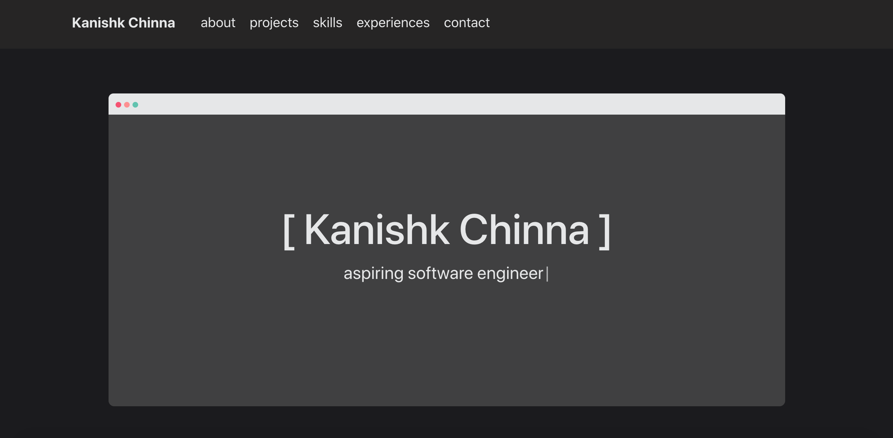

# Personal Portfolio Website

This website showcases some of the things I've worked on and provides a brief insight into who I am. [Take a look over here](https://kchinna.github.io/).
The design is inspired by the way small windows appear on MacOS, featuring the close, minimize, and fullscreen buttons at the top left of the window. 
I developed this website as I learned React, using it as a hands on learning experience while also updating my previous portfolio website that did not employ React. 
 

 

The website consists of several sections, each of which provide a unique insight and can be accessed via the responsive navbar at the top. 
I used React-Bootstrap Grid extensively throughout the website in order to create a responsive experience that is easy to use across all devices. 
 

The "About Me" section provides a summary of who I am, describing some of my hobbies and how I got interested in programming. 
I've also included a "Projects" section that showcases some of the fascinating personal projects I've done, providing a brief summary of what they do and the technologies I learned while developing them.
They also include links to their respective GitHub repositories in case you're interested. 
In the "Skills" section, you can take a look at a comprehensive list of technical skills that I have learned and applied. 
The "Experiences" section displays my professional work experiences, each of which have taught me important skills and lessons that have helped me better myself. 
Lastly, the "Contact" section at the footer of the site provides several ways that you can reach out to me and also provides a link to my resume. 
 
 
 
 
 

# Getting Started with Create React App

This project was bootstrapped with [Create React App](https://github.com/facebook/create-react-app).

## Available Scripts

In the project directory, you can run:

### `npm start`

Runs the app in the development mode.\
Open [http://localhost:3000](http://localhost:3000) to view it in your browser.

The page will reload when you make changes.\
You may also see any lint errors in the console.

### `npm test`

Launches the test runner in the interactive watch mode.\
See the section about [running tests](https://facebook.github.io/create-react-app/docs/running-tests) for more information.

### `npm run build`

Builds the app for production to the `build` folder.\
It correctly bundles React in production mode and optimizes the build for the best performance.

The build is minified and the filenames include the hashes.\
Your app is ready to be deployed!

See the section about [deployment](https://facebook.github.io/create-react-app/docs/deployment) for more information.

### `npm run eject`

**Note: this is a one-way operation. Once you `eject`, you can't go back!**

If you aren't satisfied with the build tool and configuration choices, you can `eject` at any time. This command will remove the single build dependency from your project.

Instead, it will copy all the configuration files and the transitive dependencies (webpack, Babel, ESLint, etc) right into your project so you have full control over them. All of the commands except `eject` will still work, but they will point to the copied scripts so you can tweak them. At this point you're on your own.

You don't have to ever use `eject`. The curated feature set is suitable for small and middle deployments, and you shouldn't feel obligated to use this feature. However we understand that this tool wouldn't be useful if you couldn't customize it when you are ready for it.
